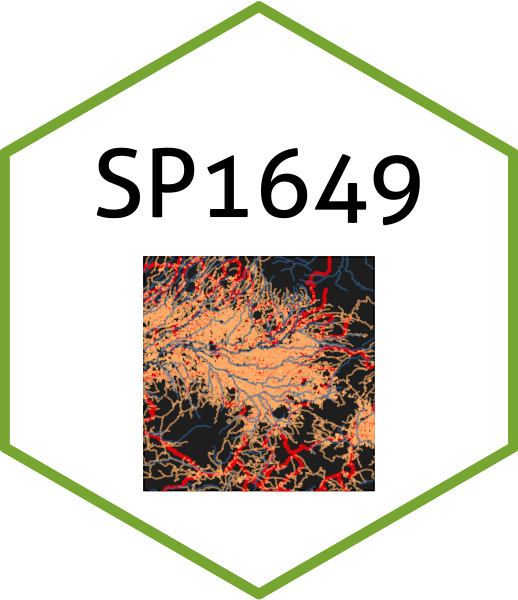

<figure>
  
</figure>

Este repositorio contiene las entregas de la clase.

<table style="width:100%">
  <tr>
    <th width="10%"> Fecha </th>
    <th width="25%">  Entrega </th>
    <th width="25%">  Documento </th>
  </tr>
  <tr>
    <td width="10%"> 13.08.2020 </td>
    <td width="25%">  <a href="Lab0.html"> Laboratorio 0 </td>
    <td width="25%">  <a href="Lab0.html"> Lab0.html</td>
  </tr>
  <tr>
    <td width="10%"> 10.09.2020 </td>
    <td width="25%"> <a href="https://malfaro2.github.io/SP1649-II20/SP1649_c05_2020.html#53">Lab2</a>   
       <a href="london_street.csv">Datos</a> </td>
    <td width="25%">  <a href="LAb2_MarianaCubero.pdf"> Entrega 2 </td>
  </tr>
  <tr>
    <td width="10%"> 24.09.2020 </td>
    <td width="25%">  <a href="https://rspatial.org/raster/analysis/4-interpolation.html">Lab3</a> </td>
    <td width="25%">  <a href="laboratorio-3.pdf">Entrega 3 </td>
  </tr>
    <tr>
    <td width="10%"> 22.10.2020 </td>
    <td width="25%">  <a href="https://rspatial.org/raster/analysis/3-spauto.html"> Lab5 </a> </td>
    <td width="25%"> <a href="Lab-5.pdf">Entrega 5 </td>
  </tr>
    <tr>
    <td width="10%"> 29.10.2020 </td>
    <td width="25%">  <a href="https://mcubero05.github.io/ProyectoFinalSP1649/">Proyecto Final  </a>  </td>
    <td width="25%">   </td>
</table>
